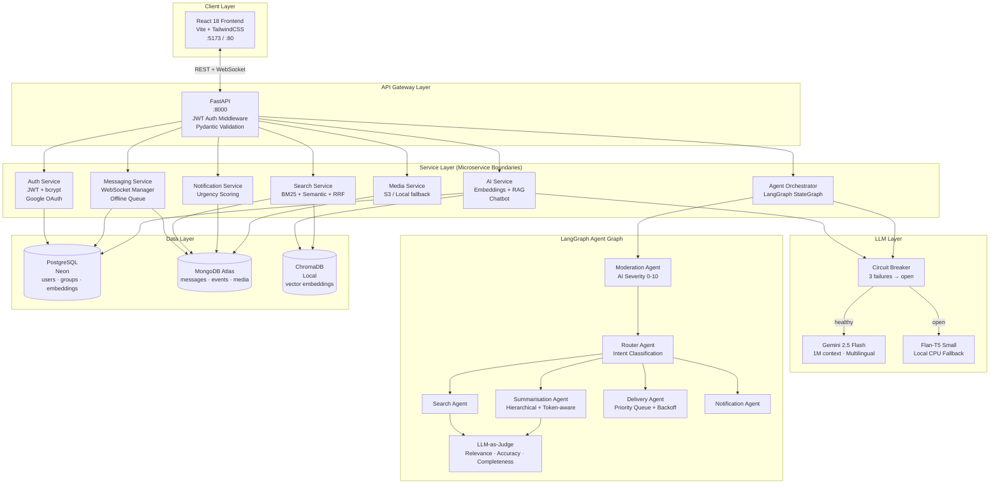

# System Architecture

## Overview

The platform is a **polyglot microservices POC** built on FastAPI, with three independent data stores and a multi-agent AI layer orchestrated via LangGraph.

---

## Component Diagram



---

## POC vs Production Comparison

| Concern | POC (Current) | Production Target |
|---|---|---|
| **API Gateway** | FastAPI handles routing directly | Dedicated API Gateway (Kong / AWS API GW) with rate limiting, WAF |
| **Load Balancing** | Single uvicorn worker | Load balancer (nginx / AWS ALB) across ≥3 pods |
| **Horizontal Scaling** | Single process | Stateless FastAPI pods, autoscaled via Kubernetes HPA |
| **WebSocket Scaling** | In-memory connection map | Redis Pub/Sub fanout across pods |
| **Vector DB** | ChromaDB (local disk) | Pinecone / Weaviate (managed, replicated) |
| **LLM** | Single Gemini API key | Key pool + multiple model tiers (Flash for latency, Pro for quality) |
| **Message Queue** | MongoDB TTL index as offline queue | Kafka / RabbitMQ for guaranteed delivery |
| **Secrets** | `.env` file | AWS Secrets Manager / HashiCorp Vault |
| **Observability** | Structured logs (structlog) | Prometheus metrics + Grafana dashboard + Jaeger traces |
| **CI/CD** | Manual deploy | GitHub Actions → Docker build → ECR → K8s rolling deploy |
| **Database** | Neon free tier + MongoDB Atlas M0 | Production clusters with read replicas and automated backups |

---

## Kubernetes Production Architecture

```mermaid
graph LR
    Internet --> LB[AWS ALB<br/>SSL Termination]
    LB --> IG[Ingress Controller<br/>nginx]
    IG --> FE[Frontend Pods<br/>nginx:80<br/>replicas=2]
    IG --> BE[Backend Pods<br/>FastAPI:8000<br/>replicas=3]
    BE --> Redis[(Redis<br/>WebSocket Pub/Sub<br/>Session Cache)]
    BE --> PG[(RDS PostgreSQL<br/>pgvector extension)]
    BE --> Mongo[(DocumentDB / Atlas)]
    BE --> Vec[(Pinecone<br/>Vector Store)]
    BE --> GeminiAPI[Gemini API<br/>Key Pool]
    BE --> CM[ConfigMap<br/>App Settings]
    BE --> Secret[K8s Secrets<br/>API Keys)]
```

---

## Design Patterns

| Pattern | Component | Purpose |
|---|---|---|
| Circuit Breaker | `gemini_client.py` | Prevent cascade failure when LLM API is down |
| Repository | `database.py` | Abstract DB access; swap ChromaDB → Pinecone without touching service layer |
| Strategy | `search_service.py` | Pluggable BM25 / Semantic / RRF strategies |
| Observer | `websocket_manager.py` | Event-driven real-time message delivery |
| LLM-as-Judge | `judge_agent.py` | Automated quality gate for AI outputs |
| Singleton | Model loaders | `init_embedding_service()`, `init_gemini()` called once at startup |
| Graceful Degradation | Multiple layers | BM25 if vector fails · Flan-T5 if Gemini fails · stub if Flan-T5 fails |
