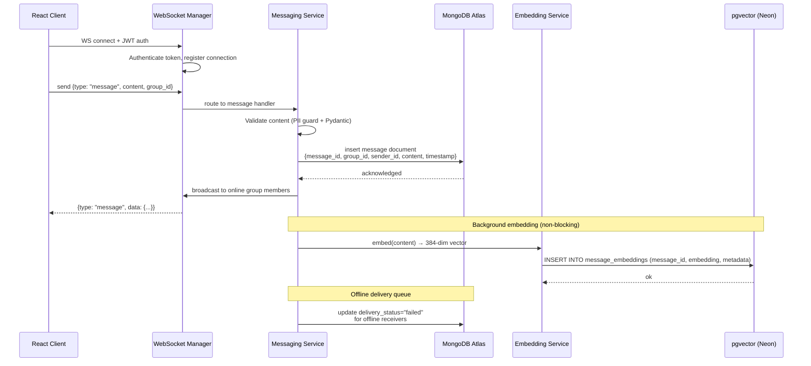
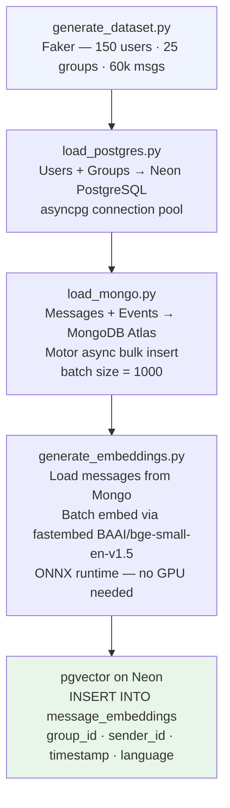

# Data Flow: Message Ingestion

Covers two ingestion paths: **real-time WebSocket send** and **bulk dataset load**.

---

## Real-Time Ingestion Flow



---

## Bulk Dataset Ingestion Flow

Used during initial setup (`dataset/load_mongo.py`, `dataset/generate_embeddings.py`).



---

## Storage Schema

### PostgreSQL (Neon)
```
users(user_id UUID PK, display_name, email, language, created_at)
groups(group_id UUID PK, group_name, created_at)
group_members(group_id FK, user_id FK)
```

### MongoDB Atlas
```js
messages: {
  message_id: UUID,
  group_id: UUID,
  sender_id: UUID,
  content: String,
  timestamp: ISODate,
  delivery_status: "delivered" | "failed" | "pending",
  last_retry_at: ISODate,
  retry_count: Int,
  delivery_escalated: Bool,
  message_type: "text" | "image" | "file",
  language: "en" | "ja"
}
```

### pgvector on Neon PostgreSQL
```sql
message_embeddings (
  message_id  TEXT PRIMARY KEY,
  embedding   vector(384),        -- BAAI/bge-small-en-v1.5 via fastembed
  content     TEXT,
  sender_id   TEXT,
  group_id    TEXT,
  receiver_id TEXT,
  media_type  TEXT,
  language    TEXT
)
-- Cosine similarity index: embedding <=> query_vector
```

---

## Key Design Decisions

- **Async throughout**: asyncpg + Motor ensure zero blocking I/O during ingestion.
- **Batch insert to pgvector**: messages embedded and inserted in batches via `ON CONFLICT DO NOTHING` to avoid duplicates.
- **Embedding at ingest time**: vectors are pre-computed so search has zero embedding latency at query time.
- **MongoDB TTL index**: messages older than 30 days auto-expire from the failed-delivery queue.
