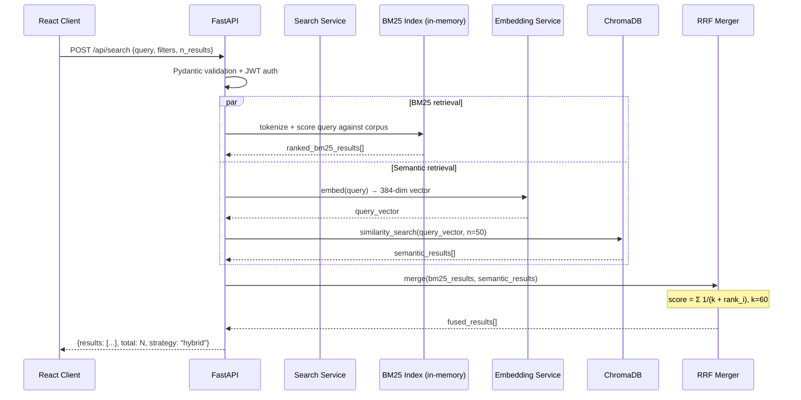
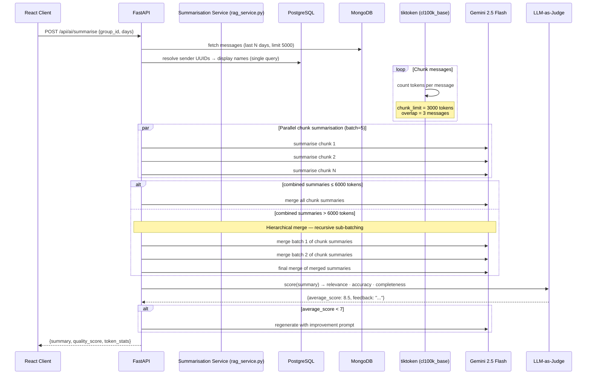
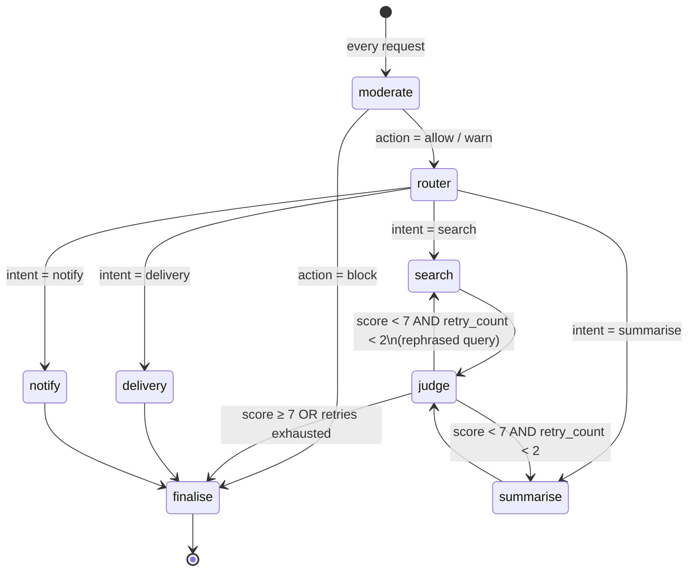

# Data Flow: Retrieval & AI Query

Covers three retrieval paths: **hybrid search**, **RAG summarisation**, and **multi-agent orchestration**.

---

## Hybrid Search Flow



---

## RAG Summarisation Flow



---

## Multi-Agent Orchestration Flow (LangGraph)



### State passed through the graph

| Field | Set by | Used by |
|---|---|---|
| `query` | Caller | moderate, router, search, judge |
| `intent` | router | conditional edge `_by_intent` |
| `moderation_result` | moderate | finalise (block reason, severity) |
| `retry_query` | judge | search (rephrased query on retry) |
| `search_result` | search | judge, finalise |
| `summarisation_result` | summarise | judge (reuses internal quality_score), finalise |
| `judge_result` | judge | conditional edge `_after_judge`, finalise |
| `retry_count` | judge (increments) | `_after_judge` (caps at 2) |
| `final_response` | finalise | returned to caller |

---

## Graceful Degradation Layers

```
Request
  │
  ├─► Semantic search available?
  │     YES → BM25 + Semantic + RRF (hybrid, best quality)
  │     NO  → BM25 only (keyword, still useful)
  │
  ├─► Gemini available?
  │     YES → Gemini 2.5 Flash (full LLM quality)
  │     NO (circuit open) → Flan-T5 Small on CPU (local inference)
  │     NO (Flan-T5 unavailable) → Extractive stub (first 20 words)
  │
  └─► ChromaDB available?
        YES → Vector similarity search
        NO  → MongoDB full-text search fallback
```
